# 基于Springboot的房屋租赁系统

## Springboot-0028


## 技术栈

Springboot mybatisplus vue mysql maven


## 数据库表(13张)


## 功能介绍

```properties
租客：
租客进入本系统可查看系统信息，包括网站首页、公告信息以及房屋信息，注册登录主要功能模块包括个人中心、看房申请管理、租赁合同管理、收租信息管理、报修信息管理
管理员：
个人中心、公告信息管理、租客管理、户主管理、房屋信息管理、看房申请管理、租赁合同管理、收租信息管理、报修信息管理、收租统计管理以及维修数据管理
```


## 图片

### 前台

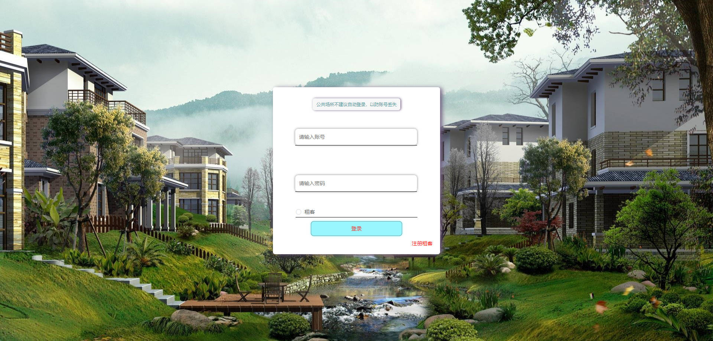


### 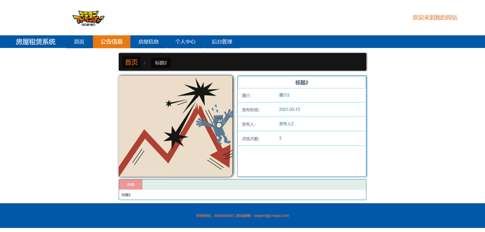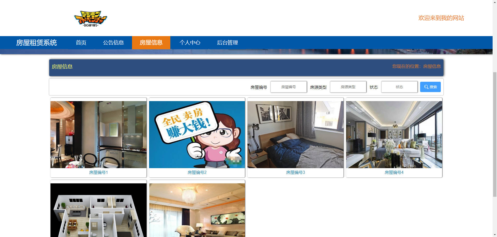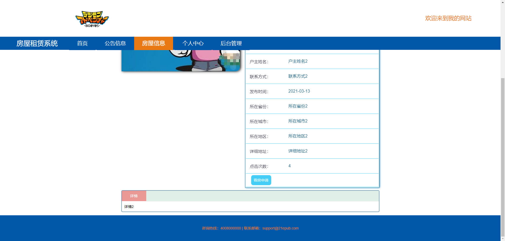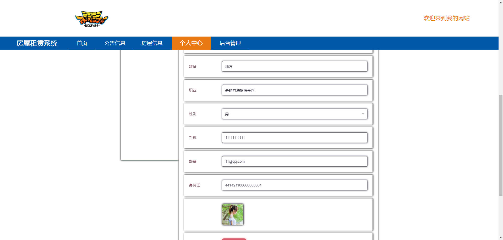后台

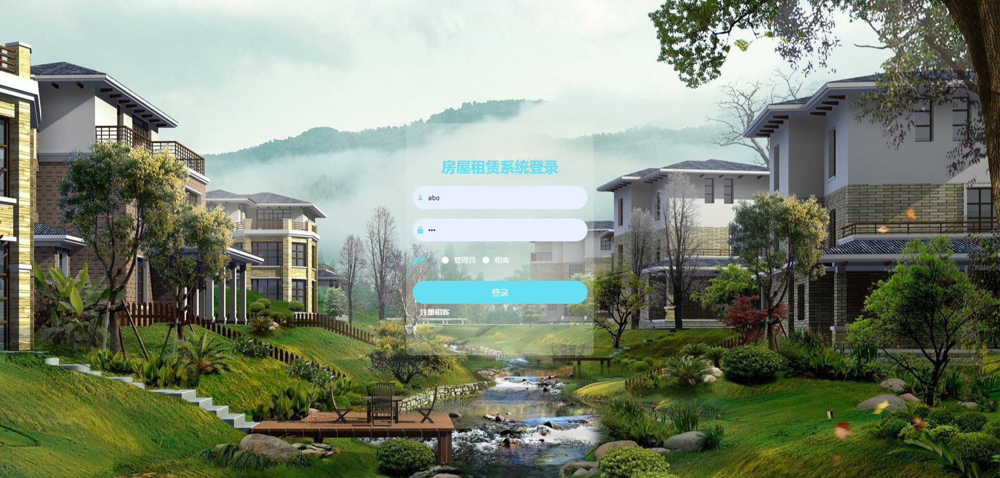

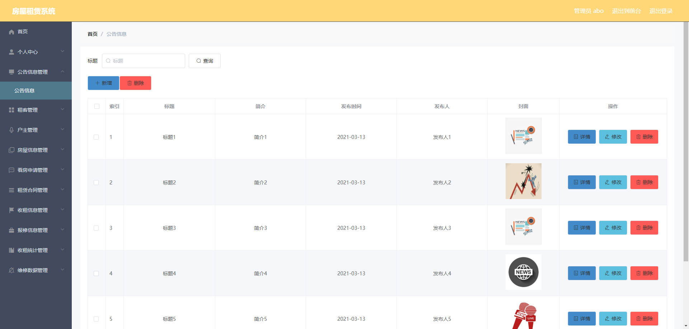

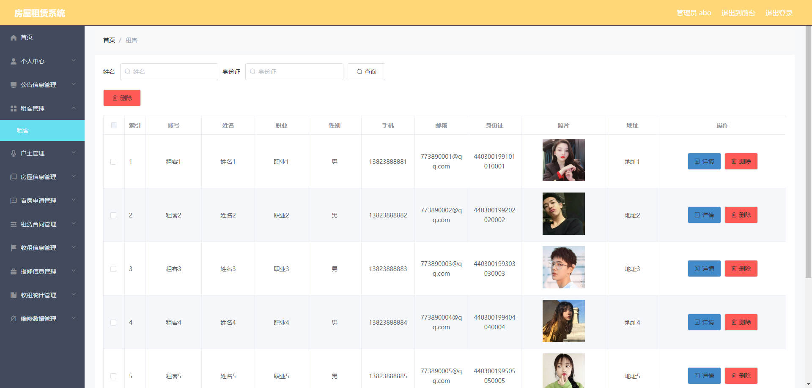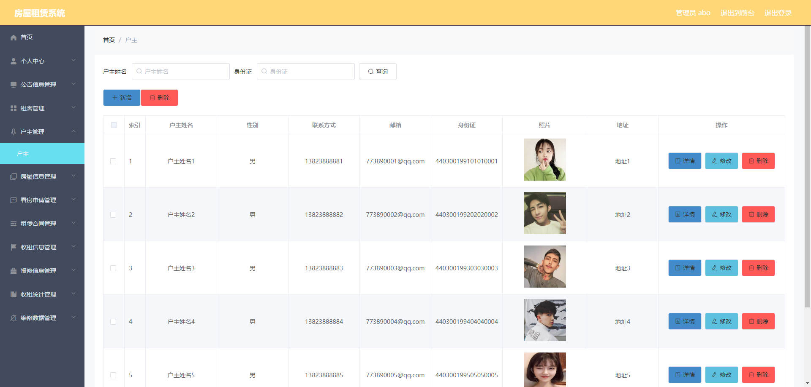

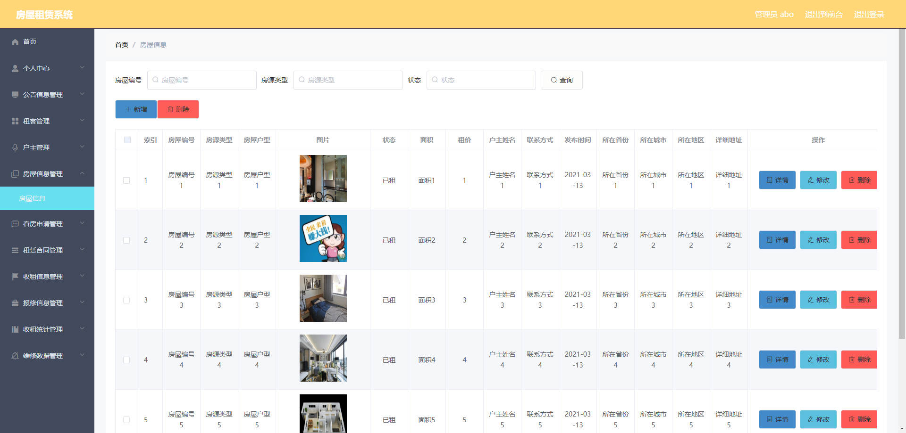


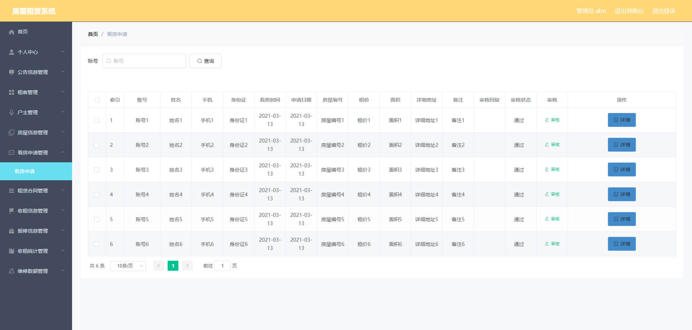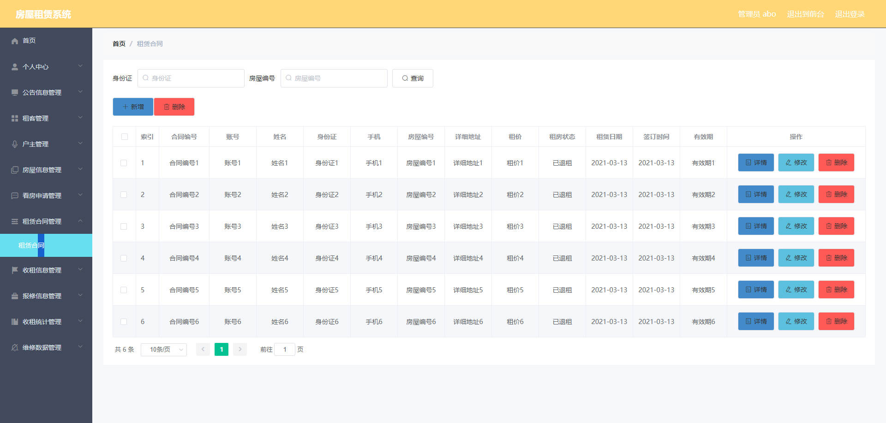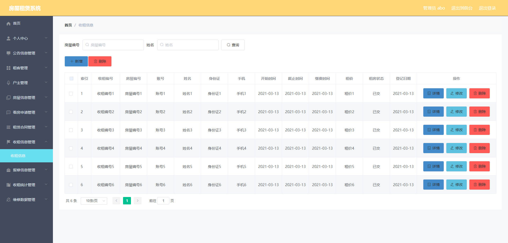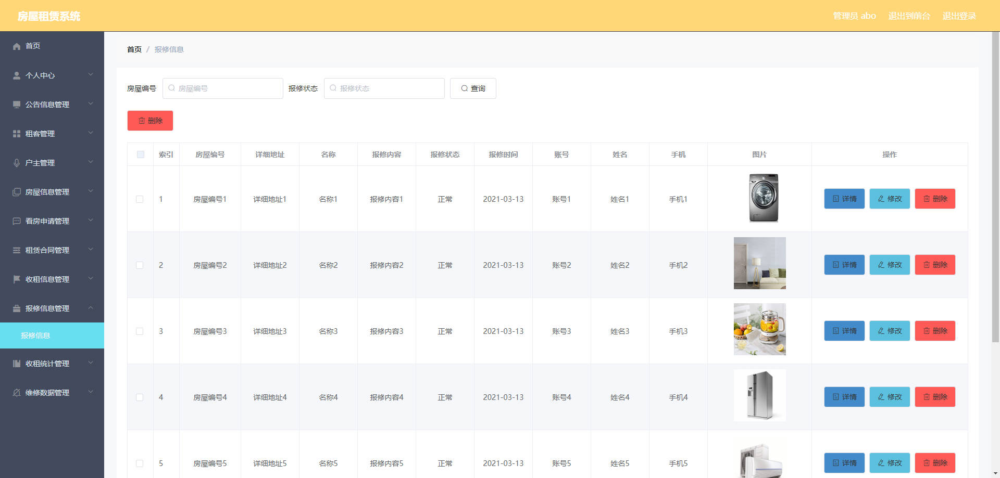

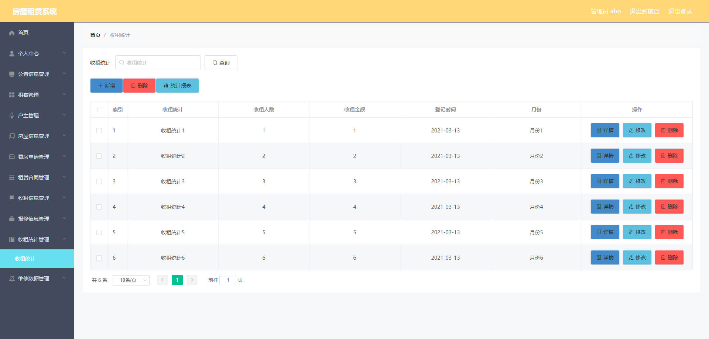

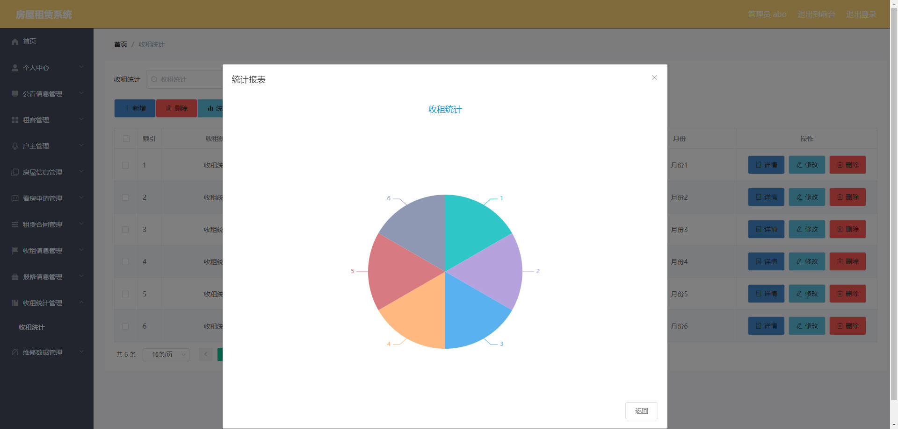

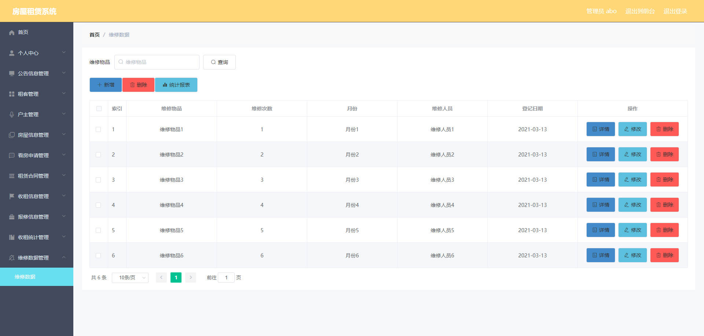

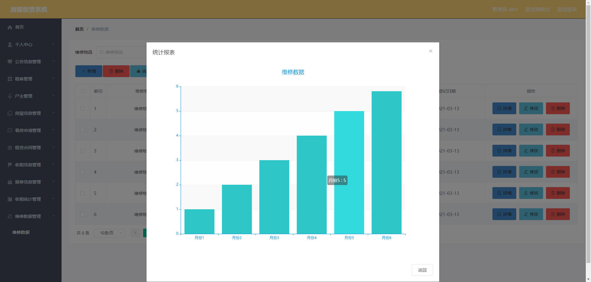


## 访问路径

### 前台

```properties
http://localhost:8080/springboot93c4v/front/pages/login/login.html

账号 11
密码 11
```

### 后台

```properties
http://localhost:8080/springboot93c4v/admin/dist/index.html#/login

账号 abo
密码 abo
```


## 功能图

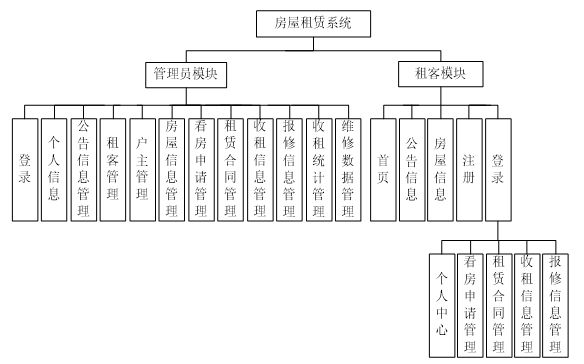


## 文档目录

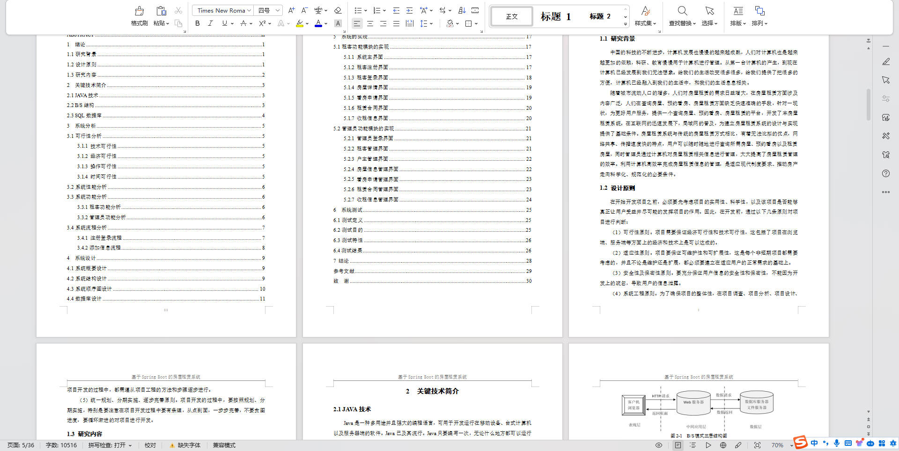


## 打赏或交流


